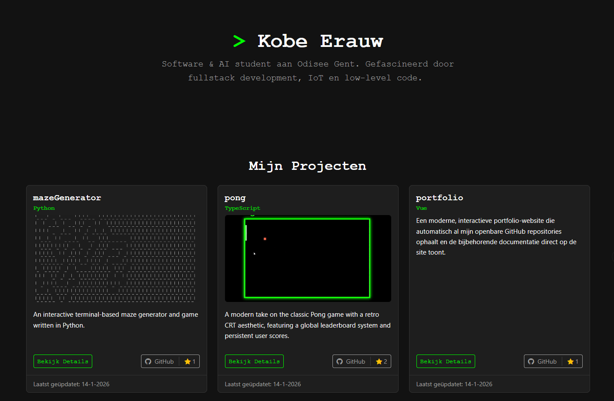

# 📂 Portfolio - GitHub Explorer

Een moderne portfolio-website met een subtiele retro-vibe die automatisch al mijn openbare GitHub repositories ophaalt en de bijbehorende documentatie direct op de site toont.


## 📸 Preview



## 🌐 Live Demo

**[Bekijk mijn portfolio hier!](https://kobeerauw.com/)**

De website is een overzicht van al mijn codeer-projecten, automatisch opgebouwd uit mijn GitHub repositories.

## 🌟 Features

- **Automatisch uit GitHub**: Elke build haalt al mijn openbare repositories en hun README's op en maakt er pagina's van.
- **Eén pagina per project**: `/project/<naam>` toont de README van dat project, met een eigen titel en beschrijving voor Google.
- **SEO van bij de basis**: Elke pagina is gewone HTML met canonical URL, Open Graph en structured data; plus een automatische `sitemap.xml`.
- **Subtiele Retro Aesthetic**: Een modern dark theme met neon-groene accenten en retro typografie voor een unieke "hacker-lite" look.
- **Smart Asset Handling**: Relatieve afbeeldingen en links in README's wijzen automatisch naar de juiste plek op GitHub.
- **Cloudflare Middleware Analytics**: Gebruikt Cloudflare Pages Middleware om bezoekersstatistieken (hits, land, user-agent) veilig te loggen naar een externe API zonder de laadtijd te beïnvloeden.
- **Snel**: Geen API-calls in de browser; bijna geen JavaScript (enkel de typewriter en tooltips).
- **Responsive Design**: Volledig geoptimaliseerd voor desktop, tablet en mobiel.

## 🚀 Technologieën

- **Astro**: Bouwt de site tijdens de build om naar statische HTML-pagina's.
- **TypeScript**: Voor het ophalen en verwerken van de GitHub-data.
- **Bootstrap 5 & Custom CSS**: Krachtige grid-layout gecombineerd met een op maat gemaakt retro-thema.
- **Bootstrap Icons**: Gebruik van de officiële Bootstrap iconenset voor een consistente UI.
- **Marked.js + DOMPurify**: Zet README's om naar veilige HTML.
- **Cloudflare Pages & Middleware**: Hosting platform met serverless middleware voor analytics.

## 📁 Project Structuur

```
├── src/
│   ├── layouts/
│   │   └── Base.astro          # Layout + de ENIGE plek voor <head> (titel, beschrijving, SEO)
│   ├── pages/
│   │   ├── index.astro         # Homepage met intro en projectkaarten
│   │   ├── about.astro         # "About me"-pagina
│   │   ├── project/[name].astro # Eén pagina per project
│   │   ├── 404.astro           # Pagina voor onbestaande URL's
│   │   └── sitemap.xml.ts      # /sitemap.xml
│   ├── components/
│   │   ├── ProjectCard.astro   # Kaart van één project
│   │   └── Typewriter.astro    # Typ-animatie van de intro
│   ├── lib/
│   │   ├── site.ts             # Naam, teksten en links van de site
│   │   ├── about.ts            # Teksten van de "About me"-pagina (ervaring, opleiding, skills)
│   │   ├── photo.ts            # Profielfoto (bron: src/assets/kobe-erauw.jpg)
│   │   ├── github.ts           # Repositories + README's ophalen tijdens de build
│   │   └── markdown.ts         # README → veilige HTML
│   └── styles/retro.css        # Custom retro-thema
├── functions/_middleware.ts    # Cloudflare analytics
├── .github/workflows/rebuild.yml # Wekelijkse rebuild
└── README.md
```

## ⚙️ Hoe het werkt

1. **Build**: `astro build` haalt via de GitHub API alle repositories van `kobe-erauw` op, plus de README van elk project.
2. **Pagina's**: Voor elk project wordt `dist/project/<naam>.html` gemaakt, plus de homepage, een 404-pagina en `sitemap.xml`. Cloudflare Pages serveert die als `/project/<naam>`.
3. **Welke projecten?**: Zet `[hidden]` in de GitHub-beschrijving van een repo om hem te verbergen, en `[image: bestand.png]` om een afbeelding uit de `assets/` map van die repo te tonen.
4. **Up-to-date blijven**: Omdat alles tijdens de build gebeurt, verschijnen nieuwe projecten en sterren pas na een nieuwe build. `.github/workflows/rebuild.yml` start daarom elke maandag een build (zie de uitleg in dat bestand om het in te stellen).
5. **GitHub token**: Zet `GITHUB_TOKEN` als environment variable in Cloudflare Pages, anders kan de build tegen de rate limit van GitHub aanlopen. Lukt het ophalen niet, dan faalt de build en blijft de vorige versie online.

## 🔧 Setup & Installatie

1. Clone de repository
```bash
git clone https://github.com/Kobe-Erauw/portfolio
cd portfolio
```

2. Installeer dependencies (Node 22.12 of nieuwer)
```bash
npm install
```

3. Run development server
```bash
npm run dev
```

4. Build voor productie (controleert eerst de types)
```bash
npm run build
```

## 📝 Licentie

Dit project is open source en beschikbaar onder de MIT License.